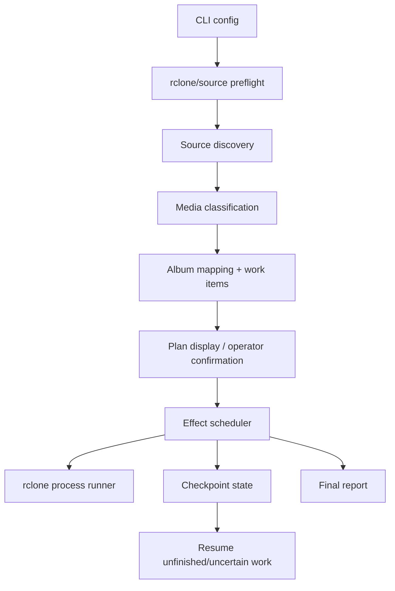

# feat: Build Immich to Google Photos migrator

## Summary

Implement a Bun/TypeScript CLI with Effect-managed discovery, planning, rclone execution, checkpointing, scheduling, and reporting. The plan uses additive rclone Google Photos uploads, safe child-process invocation, conservative parallelism, and fake-rclone tests so the migration can be developed without touching a real Google Photos account by default.

---

## Problem Frame

The current repo is a fresh Bun skeleton with no migration implementation, no tests, and no internal patterns beyond strict TypeScript configuration. The migration itself is operationally risky because it moves private media through a third-party backend where listing and verification are limited, so the implementation needs strong local planning, state, and reporting boundaries.

---

## Requirements

- R1. Recursively scan a configured source library root and identify leaf folders as migration units.
- R2. Detect media files found outside leaf folders, report them before upload, and require the operator to confirm omission or stop the run.
- R3. Derive each destination album key from the exact leaf folder basename only.
- R4. Create destination album names using `ImmichBackup: <folder name>`.
- R5. Upload multiple leaf folders with the same exact basename into the same destination album.
- R6. Treat folder names that differ by case, spacing, punctuation, or other exact string differences as different album keys.
- R7. Show the planned album mapping before upload, including album names, contributing source folders, and media counts.
- R8. Upload through the existing rclone Google Photos backend by shelling out to the local rclone CLI.
- R9. Invoke rclone through an argument-vector process API without shell command-string evaluation.
- R10. Require an explicit rclone remote and preflight the remote/account identity when rclone can expose it, without logging secrets.
- R11. Preflight destination album names, define existing/duplicate album behavior, and avoid concurrent album creation for the same destination album.
- R12. Use additive uploads and never remove media from Google Photos as part of normal migration behavior.
- R13. Classify supported media before upload, skip unsupported files with reason codes, and avoid creating empty albums for no-supported-media folders.
- R14. Support bounded parallel upload work while serializing work for the same destination album.
- R15. Define checkpointed upload work and mark it complete only after rclone success and durable local progress persistence.
- R16. Resume interrupted runs without starting from scratch; failed or uncertain work is retried or reported, not treated as complete.
- R17. Keep checkpoint, plan, report, and any captured diagnostic artifacts privacy-safe; v1 does not create separate durable logs.
- R18. Produce a final report distinguishing completed, failed, uncertain, skipped, no-supported-media, outside-leaf, and remaining work.

**Origin actors:** A1 Operator, A2 Source library, A3 rclone Google Photos backend
**Origin flows:** F1 Plan and migrate, F2 Resume after interruption
**Origin acceptance examples:** AE1 repeated basename merge, AE2 exact-name separation, AE3 additive same-album upload, AE4 unsupported file reporting, AE5 resume behavior, AE6 non-leaf media reporting, AE7 duplicate destination album preflight, AE8 no-supported-media folders

---

## Scope Boundaries

- Do not build direct Google Photos API integration.
- Do not use `rclone sync` or any destructive upload behavior.
- Do not deduplicate media beyond rclone/Google Photos behavior.
- Do not normalize, rename, or manually merge near-duplicate folder names.
- Do not make real Google Photos integration tests part of the default automated suite.
- Do not build a general-purpose migration framework beyond this Immich-to-Google-Photos tool.
- Do not introduce broad lint/format/tooling work unless implementation reveals a narrow need.

### Deferred to Follow-Up Work

- Rich progress UI: A simple terminal progress/reporting surface is enough for the first implementation.
- Advanced media probing: MIME sniffing or metadata extraction can follow if the extension allowlist produces too many false skips.
- Optional rclone RC progress integration: Useful later, but the first version should use process exits, captured output, and local state.
- Internal upload chunking: v1 checkpointing stays at source-folder-to-album contribution granularity; split batches can be added later if large-folder runs prove the need.

---

## Context & Research

### Relevant Code and Patterns

- `index.ts` is only a placeholder entrypoint, so this plan introduces the module structure.
- `package.json` has no scripts and no runtime dependencies yet.
- `tsconfig.json` already enables strict TypeScript, `noUncheckedIndexedAccess`, and Bun types.
- `.cursor/rules/use-bun-instead-of-node-vite-npm-pnpm.mdc` prefers Bun commands and APIs.
- No `AGENTS.md`, `CLAUDE.md`, `STRATEGY.md`, or `docs/solutions/` files were found.

### Institutional Learnings

- No prior `docs/solutions/` learning docs exist in this repo.
- The reviewed requirements doc is the primary internal source for migration behavior and constraints.

### External References

- Bun docs: use `process.argv` for script flags, `Bun.spawn` for argument-vector child processes, Bun file APIs for simple IO, `node:fs/promises` for richer filesystem operations, and `bun:test` for tests.
- Effect docs: use typed errors, `Effect.tryPromise`, retry schedules, scoped resources, bounded concurrency, and semaphores for orchestration.
- rclone Google Photos docs: uploads and album creation are supported, but listing/metadata verification is limited; `rclone copy` is additive, `rclone sync` is destructive, `--gphotos-batch-mode=sync` checks completion, and async batching should be avoided for checkpoint safety.
- Google Photos API updates: post-2025 listing may only expose app-created data, so remote album preflight is best-effort and local checkpoints remain the source of migration truth.

---

## Key Technical Decisions

- Bun CLI with modular TypeScript: Keep `index.ts` as the entrypoint and put implementation modules under `src/` so discovery, planning, rclone, checkpointing, scheduling, and reporting can be tested independently.
- Effect-owned orchestration: Model each stage as typed Effect programs so retries, cancellation, typed errors, and bounded concurrency are explicit.
- Safe rclone boundary: Route every rclone invocation through one process-runner abstraction using argv-style spawning, never shell command strings.
- Additive upload primitive: Use `rclone copy` into `remote:album/<album>` after album resolution; never use `sync`.
- Conservative rclone settings: Prefer sync batch mode and low per-process transfer counts so Effect-level concurrency is the main operator-visible throttle.
- Work-item granularity: Plan around source-folder-to-album contributions as the checkpointed unit for v1.
- Supported-file upload contract: rclone uploads must consume the planned supported-file manifest for each contribution, not the raw leaf folder wholesale.
- Remote album policy: Treat album listing as best-effort and limited to rclone-visible/app-writable albums. Reuse a single visible matching album only as a rclone-visible target, hard-stop on duplicate visible matches, persist locally resolved album ownership, and require an explicit warning acknowledgement when listing cannot prove uniqueness.
- Media classification: Start with a documented extension allowlist for common Google Photos-compatible images and videos; report all skips with reasons and defer deeper sniffing unless needed.
- Local state identity: Bind checkpoints to a migration identity that includes source root, rclone remote, album policy version, media allowlist version, and planned work-item/file-manifest fingerprints so changed plans cannot be silently skipped.
- Exclusive run lock: Acquire a lock in the state directory before remote preflight or upload scheduling so two CLI invocations cannot race album creation or checkpoint writes.
- Local artifact privacy: Store checkpoints/reports outside the source tree by default or in an explicit state directory, avoid credentials, minimize absolute paths in shareable reports, use restrictive permissions where supported, and avoid separate durable logs in v1.
- rclone trust boundary: Resolve and display the rclone binary path, validate remote/path components before spawning, and pass a minimal environment rather than blindly inheriting unrelated secrets.
- Default testing posture: Unit and integration-style tests use temp fixtures and fake rclone runners; real cloud runs are manual operator workflows.

---

## Open Questions

### Resolved During Planning

- CLI/config contract: Use explicit CLI options for source root, rclone remote, state/report location, concurrency, dry-run/plan-only behavior, and acknowledgement controls for non-leaf media plus listing/identity uncertainty. Environment variables can be a later convenience, not the primary contract.
- Media allowlist strategy: Use extension-based classification first because it is predictable and easy to audit in reports.
- Default concurrency: Use a conservative default of a couple of album-parallel rclone workers and low rclone internal transfer counts; make the value configurable.
- Checkpoint granularity: Use source-folder-to-album contribution work items as the v1 checkpoint unit.
- Duplicate visible album behavior: Treat duplicate visible destination album names as a hard stop in v1 rather than an overrideable confirmation path.

### Deferred to Implementation

- Exact CLI option names: Decide while implementing the parser so names stay consistent with the final command shape.
- Exact media extension list: Finalize from rclone/Google Photos docs and keep it in one named module for review.
- Retry classification details: Start with obvious transient failures such as timeouts and rate-limit-like rclone failures, then adjust based on actual rclone outputs observed during manual dry runs.
- Account identity display: rclone Google Photos may not expose a rich account identity; preflight should show whatever non-secret identity/listing signal is available.
- Large-folder batching: If folder-level rclone invocations prove unreliable, add a follow-up chunking design without changing the v1 checkpoint model silently.

---

## Output Structure

    src/
      cli.ts
      config.ts
      discovery.ts
      media.ts
      plan.ts
      rclone.ts
      checkpoint.ts
      scheduler.ts
      report.ts
      types.ts
    tests/
      helpers/
      cli.test.ts
      discovery.test.ts
      media.test.ts
      plan.test.ts
      rclone.test.ts
      checkpoint.test.ts
      scheduler.test.ts
      report.test.ts
      integration-fake-rclone.test.ts

---

## High-Level Technical Design

> *This illustrates the intended approach and is directional guidance for review, not implementation specification. The implementing agent should treat it as context, not code to reproduce.*

---

## Implementation Units

- U1. **Project Scaffolding and Test Harness**

**Goal:** Establish the runtime dependencies, package scripts, module skeleton, and repeatable Bun test harness the rest of the plan depends on.

**Requirements:** R8, R9, R17

**Dependencies:** None

**Files:**
- Modify: `package.json`
- Modify: `bun.lock`
- Modify: `tsconfig.json`
- Create: `src/types.ts`
- Create: `tests/helpers/temp-fixtures.ts`
- Create: `tests/helpers/fake-process-runner.ts`

**Approach:**
- Add `effect` as a runtime dependency.
- Add scripts for running the CLI, running tests, and typechecking.
- Keep imports top-level and shared domain types in `src/types.ts`.
- Add test helpers for temp source trees, temp state directories, and fake rclone process outcomes.
- If `AbortSignal` typing needs additional libraries, update `tsconfig.json` narrowly.

**Patterns to follow:**
- Existing strict TypeScript settings in `tsconfig.json`.
- Bun-first project rule in `.cursor/rules/use-bun-instead-of-node-vite-npm-pnpm.mdc`.

**Test scenarios:**
- Test expectation: none for runtime behavior; this unit is scaffolding. Verification comes from subsequent units using the helpers.

**Verification:**
- The repo has a real module tree under `src/`.
- Bun tests can import shared helpers and run at least one trivial helper-backed test.
- Typechecking can run against the new source tree.

---

- U2. **CLI Configuration and Operator Controls**

**Goal:** Parse operator input into validated runtime configuration, including source root, rclone remote, state/report locations, concurrency, dry-run behavior, and confirmation controls.

**Requirements:** R2, R7, R10, R14, R17

**Dependencies:** U1

**Files:**
- Create: `src/cli.ts`
- Create: `src/config.ts`
- Modify: `index.ts`
- Create: `tests/cli.test.ts`

**Approach:**
- Make the rclone remote and source root explicit required inputs.
- Support a plan-only mode that performs discovery/preflight/reporting without upload.
- Support explicit operator acknowledgements for omitting non-leaf media and proceeding past best-effort remote identity limits.
- Validate concurrency as a positive bounded value and keep the default conservative.
- Resolve state/report paths early so all later modules receive normalized config instead of reading process globals.

**Patterns to follow:**
- Use `process.argv` as the CLI argument source.
- Keep configuration validation separate from migration execution.

**Test scenarios:**
- Happy path: valid required inputs produce normalized config with default state/report locations and default concurrency.
- Error path: missing source root or remote returns a typed configuration error.
- Error path: invalid concurrency values are rejected before any filesystem or rclone work begins.
- Edge case: dry-run/plan-only mode is represented in config without upload side effects.
- Edge case: confirmation bypasses are explicit, not implicit defaults.

**Verification:**
- `index.ts` delegates to the CLI module.
- Invalid input fails before source scanning or process spawning.

---

- U3. **Source Discovery, Media Classification, and Album Plan**

**Goal:** Build the local migration plan from the Immich tree: leaf folders, non-leaf media anomalies, supported/unsupported media classification, exact-basename grouping, no-supported-media handling, and album contribution counts.

**Requirements:** R1, R2, R3, R4, R5, R6, R7, R13, R18

**Dependencies:** U1, U2

**Files:**
- Create: `src/discovery.ts`
- Create: `src/media.ts`
- Create: `src/plan.ts`
- Create: `tests/discovery.test.ts`
- Create: `tests/media.test.ts`
- Create: `tests/plan.test.ts`

**Approach:**
- Walk the source tree with filesystem APIs that can handle unreadable entries and symlink boundaries deliberately.
- Treat a leaf folder as a directory with no child directories; media in directories that do have child directories is outside-leaf media.
- Classify files into supported, unsupported, and unreadable categories with reason codes.
- Group album contributions by exact leaf folder basename and derive `ImmichBackup: <folder name>` as the destination.
- Exclude no-supported-media folders from album creation while preserving them in reports.

**Patterns to follow:**
- Keep filesystem walking independent from media classification.
- Keep album grouping pure and deterministic so it is cheap to test.

**Test scenarios:**
- Covers AE1. Two leaf folders with basename `SRP photos all` under different years map to one album with two contributions.
- Covers AE2. `SRP photos all` and `SRP Photos All` map to separate albums.
- Covers AE4. A mixed folder classifies supported media for upload and unsupported files for skipped reporting.
- Covers AE6. Media in a non-leaf directory is surfaced as an upload-blocking anomaly unless explicitly confirmed later.
- Covers AE8. A leaf folder with only unsupported files does not produce an album contribution.
- Edge case: empty source root produces a clear no-work plan.
- Edge case: unreadable files or directories become reportable failures rather than unhandled exceptions.
- Edge case: unusual but valid path characters are preserved as data.

**Verification:**
- The plan object contains all information needed for pre-upload display and final reporting.
- No rclone or checkpoint code is needed to test discovery and grouping.

---

- U4. **Rclone Process Boundary and Remote Preflight**

**Goal:** Encapsulate rclone command construction, execution, album listing/creation, remote preflight, and upload primitives behind a safe, testable boundary.

**Requirements:** R8, R9, R10, R11, R12, R13, R14

**Dependencies:** U1, U2, U3

**Files:**
- Create: `src/rclone.ts`
- Create: `tests/rclone.test.ts`

**Approach:**
- Define a process-runner interface used by production Bun spawning and tests.
- Use argv-style invocation for every rclone call and pass source paths, album names, and remotes as arguments rather than shell text.
- Validate remote names and positional path components before spawning, including leading-dash and control-character cases that argv alone does not neutralize for rclone.
- Resolve and display the rclone executable path during preflight, and pass only the minimal environment needed for rclone configuration and execution.
- Preflight rclone availability and the named remote before upload.
- List visible albums best-effort, treating Google Photos visibility and app-created-album limitations as known constraints.
- Resolve albums through rclone-visible/app-writable targets and local album ownership records; duplicate visible matches are a hard stop.
- Use album creation and additive copy operations only; destructive sync behavior is not exposed by this module.
- Upload only the planned supported-file manifest for each contribution, using a reviewed manifest or staging mechanism rather than copying the raw leaf directory.
- Configure rclone upload behavior for completion visibility, not maximum throughput.

**Patterns to follow:**
- Bun child-process API for production process execution.
- Effect typed errors for process failures, timeouts, and unsupported preflight results.

**Test scenarios:**
- Happy path: album list, album create, and copy commands are built as argv arrays with no shell command string.
- Covers AE7. Duplicate visible destination album names cause an ambiguity result that upload orchestration must not silently ignore.
- Error path: missing rclone executable becomes a typed preflight failure.
- Error path: non-zero rclone exit captures sanitized stdout/stderr summaries without secrets.
- Error path: timeout or cancellation marks the process result as interrupted/uncertain.
- Edge case: album names with spaces, punctuation, parentheses, and colons remain single argument values.
- Edge case: leading-dash remotes, control characters, and invalid remote/path components are rejected before spawning rclone.
- Edge case: remote listing unavailable produces a best-effort warning path rather than pretending album uniqueness was proven.
- Edge case: unsupported source files are present in the source fixture but absent from rclone upload input.

**Verification:**
- No module outside `src/rclone.ts` constructs raw rclone command arguments.
- Tests prove command construction without invoking real rclone or Google Photos.

---

- U5. **Checkpoint State and Privacy-Safe Reporting**

**Goal:** Persist local progress durably and generate plan/final reports without leaking secrets or unnecessary private metadata.

**Requirements:** R15, R16, R17, R18

**Dependencies:** U1, U2, U3

**Files:**
- Create: `src/checkpoint.ts`
- Create: `src/report.ts`
- Create: `tests/checkpoint.test.ts`
- Create: `tests/report.test.ts`
- Modify: `.gitignore`

**Approach:**
- Store migration state under the configured state directory and add default local artifact paths to `.gitignore`.
- Acquire an exclusive state-directory run lock before remote preflight or upload work; stale lock recovery must be explicit.
- Represent work item lifecycle with explicit planned, running, complete, failed, and uncertain states.
- Persist migration identity and plan fingerprint data so resume can detect changed source roots, remotes, album policy, allowlist, and supported-file manifests.
- Write checkpoints through a temp-file-and-rename pattern and restrictive permissions where supported.
- Create state directories with private permissions where supported, warn on overly permissive existing state directories, and avoid following symlinks for state/report writes.
- Mark work complete only after a successful rclone result and successful checkpoint persistence.
- Generate a pre-upload plan report and final report with counts, album mappings, skipped files, anomalies, failures, uncertain work, and operator next actions.
- Redact or relativize paths in shareable report surfaces while keeping enough local detail in private checkpoint state to resume.
- Do not create separate durable log files in v1; captured rclone output should be sanitized into checkpoint/report diagnostics only.

**Patterns to follow:**
- Use filesystem APIs that can create parent directories, rename atomically within a directory, and apply permissions where the platform supports them.
- Keep checkpoint state machine logic independent from report formatting.

**Test scenarios:**
- Covers AE5. Completed checkpointed work is skipped on resume, while failed and uncertain work remains eligible.
- Error path: checkpoint write failure after rclone success leaves the item uncertain rather than complete.
- Error path: corrupted checkpoint state produces a recoverable diagnostic instead of silently starting over.
- Error path: valid checkpoint state for a different source root, remote, album policy, allowlist, or work manifest refuses to resume without explicit replan acknowledgement.
- Error path: a second process using the same state directory refuses to start while an active lock exists.
- Edge case: state directory does not exist and is created with restrictive permissions where supported.
- Edge case: existing state directory is group/world-readable and produces a privacy warning or refusal according to implementation policy.
- Edge case: report output includes skipped unsupported files, no-supported-media folders, outside-leaf media, failed work, uncertain work, and remaining work.
- Privacy path: report output does not include rclone config contents or secret-like values from process output.

**Verification:**
- Resume behavior can be tested entirely from checkpoint fixtures.
- Reports give the operator enough information to decide whether to rerun, inspect, or stop.

---

- U6. **Effect Scheduler and Migration Orchestration**

**Goal:** Connect configuration, discovery, rclone, checkpointing, concurrency, retries, cancellation, and reporting into the actual migration run.

**Requirements:** R2, R7, R10, R11, R12, R14, R15, R16, R18

**Dependencies:** U2, U3, U4, U5

**Files:**
- Create: `src/scheduler.ts`
- Create: `tests/scheduler.test.ts`
- Modify: `src/cli.ts`

**Approach:**
- Build an Effect workflow that runs preflight, discovery, plan display, confirmation gates, album resolution, upload scheduling, checkpoint updates, and final reporting.
- Apply global concurrency across independent album work while using per-album serialization for creation and upload contributions.
- Retry transient rclone failures with bounded backoff, while validation, configuration, and unsupported-media failures do not retry.
- On cancellation or interruption, stop scheduling new work, interrupt active processes, and mark active work as uncertain.
- Treat remote verification as weak: successful rclone exit plus durable local checkpoint is the completion signal, but only for work whose current manifest matches the checkpoint identity.

**Patterns to follow:**
- Effect retry schedules and semaphores for concurrency control.
- Process-runner abstraction from U4 rather than direct spawning.
- Checkpoint state machine from U5 rather than ad hoc booleans.

**Test scenarios:**
- Covers AE3. Two contributions for the same destination album do not execute concurrently.
- Covers AE5. Resume skips completed work and retries failed or uncertain work.
- Happy path: independent album contributions run with bounded parallelism.
- Error path: a retryable rclone failure retries up to the configured limit and then reports failure.
- Error path: a fatal validation/preflight failure stops before upload.
- Error path: cancellation marks running work uncertain and still emits a final report.
- Error path: changed source manifest on resume creates new work or requires explicit replan acknowledgement rather than silently skipping.
- Edge case: album creation is serialized even when multiple contributions share the same destination.
- Edge case: plan-only mode runs preflight/discovery/reporting but performs no album creation or upload.

**Verification:**
- Scheduler tests use fake process outcomes and deterministic fixtures.
- The CLI can execute a full fake migration without a real rclone remote.

---

- U7. **Operator Documentation and End-to-End Verification**

**Goal:** Make the tool usable by documenting setup, dry-run workflow, resumability, artifact privacy, and manual real-rclone verification.

**Requirements:** R7, R10, R14, R17, R18

**Dependencies:** U1, U2, U3, U4, U5, U6

**Files:**
- Modify: `README.md`
- Create: `tests/integration-fake-rclone.test.ts`

**Approach:**
- Replace the Bun-init README with migration-focused usage docs.
- Document the expected rclone Google Photos remote, plan-only flow, upload flow, resume behavior, local artifact locations, and privacy notes.
- Add an integration-style test using a fake rclone executable or fake process runner that exercises CLI-to-report behavior without cloud access.
- Document real Google Photos verification as a manual operator checklist, not an automated test, and label fake-rclone tests as orchestration/contract tests rather than proof of Google Photos correctness.

**Patterns to follow:**
- Keep README examples focused on user intent rather than exhaustive command recipes.
- Keep cloud credentials and remote names out of committed examples.

**Test scenarios:**
- Integration: fake source tree with repeated basenames produces a plan, runs uploads through fake rclone, writes checkpoint, and emits final report.
- Integration: rerunning after an interrupted fake migration resumes unfinished work.
- Integration: duplicate visible albums in fake rclone preflight blocks upload.
- Integration: unsupported files exist in a source fixture but are not included in the fake rclone upload manifest.
- Integration: a second invocation with the same state directory is blocked by the run lock.
- Documentation check: README covers setup, dry-run/plan-only, upload, resume, privacy artifacts, and default test strategy.

**Verification:**
- A new operator can understand how to run a dry plan, perform an upload, and resume safely.
- Default automated tests do not require a real Google Photos account.

---

## System-Wide Impact

- **Interaction graph:** `index.ts` becomes a thin entrypoint into CLI/config, then migration orchestration calls discovery, planning, rclone, checkpoint, scheduler, and report modules.
- **Error propagation:** Domain modules should return typed failures that the CLI renders as operator-facing diagnostics without exposing secrets.
- **State lifecycle risks:** Partial rclone success, interrupted processes, and checkpoint write failure must land in failed or uncertain states rather than complete.
- **API surface parity:** The CLI is the only intended public interface in v1; internal modules exist for testability, not external consumption.
- **Integration coverage:** Fake-rclone integration tests cover module boundaries without hitting Google Photos.
- **Unchanged invariants:** The tool remains upload-focused and does not delete remote media, delete albums, normalize folder names, or deduplicate local media.

---

## Risks & Dependencies

| Risk | Mitigation |
|------|------------|
| Google Photos listing is incomplete or limited to app-created data | Treat album preflight as best-effort, surface limitations to the operator, and rely on local checkpoints for migration truth |
| Duplicate uploads after uncertain partial success | Track uncertain work explicitly, keep uploads additive, and require final reports to call out uncertainty |
| rclone internal concurrency multiplies API pressure | Keep low default rclone transfer settings and make Effect-level concurrency the visible operator control |
| Same-album concurrent writes create duplicate albums or ambiguous state | Serialize album creation and upload contributions for each destination album |
| Unsupported files are silently omitted | Classify before upload and include reason-coded skips in plan and final reports |
| Unsupported files reach rclone despite local classification | Pass an explicit supported-file manifest or equivalent filtered input to the rclone boundary |
| Checkpoint state is reused for a changed migration | Persist migration identity and work-manifest fingerprints, then refuse or explicitly replan on drift |
| Two tool invocations race the same migration | Use an exclusive run lock in the state directory |
| Local artifacts leak private paths or credentials | Avoid secrets, minimize full paths in reports, write restrictive permissions where supported, and ignore default artifact directories |
| Real Google Photos behavior differs from fake tests | Keep manual dry-run/upload checklist in README and design rclone wrapper so observed outputs can refine retry handling later |

---

## Documentation / Operational Notes

- Update `README.md` from Bun starter text to migration usage documentation.
- Document rclone Google Photos limitations that matter for this tool: original-quality storage usage, app-created album visibility, weak metadata, and no destructive deletion support.
- Document that default tests use fake rclone behavior and do not verify a real Google Photos account.
- Document artifact retention and deletion guidance for checkpoints and reports, and state that v1 does not write separate durable logs.

---

## Sources & References

- **Origin document:** [docs/brainstorms/immich-google-photos-migration-requirements.md](../brainstorms/immich-google-photos-migration-requirements.md)
- Project config: `package.json`, `tsconfig.json`, `index.ts`, `.cursor/rules/use-bun-instead-of-node-vite-npm-pnpm.mdc`
- rclone Google Photos docs: [https://rclone.org/googlephotos/](https://rclone.org/googlephotos/)
- rclone copy docs: [https://rclone.org/commands/rclone_copy/](https://rclone.org/commands/rclone_copy/)
- rclone mkdir docs: [https://rclone.org/commands/rclone_mkdir/](https://rclone.org/commands/rclone_mkdir/)
- Bun child process docs: [https://bun.com/docs/runtime/child-process](https://bun.com/docs/runtime/child-process)
- Bun test docs: [https://bun.com/docs/test/writing](https://bun.com/docs/test/writing)
- Effect docs: [https://effect.website/docs/](https://effect.website/docs/)
